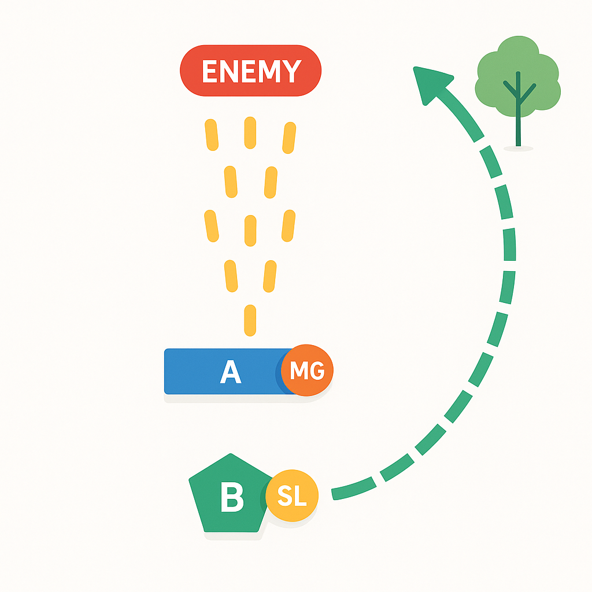

# :material-wave-arrow-up: Drill #1A | Ataque de escuadra

## Representación gráfica

## Descripción

Situacion: La Escuadra se mueve conduciendo un “movimiento a contacto” o un ataque apresurado, o deliberado.

**Acciones:**
1. El líder planea cómo establecer una base de fuego y cuando inicia el contacto. En caso
de que el enemigo inicie el contacto primero se debe reaccionar al contacto (DRILL #2).

2. Se ubica al enemigo y se suprime con armas automáticas ya sea por volumen o
precisión de fuegos. Se despliega humo (M203) para ocultar el movimiento del elemento
maniobra. También se utilizan fuegos indirectos y no se espera en este apartado.
3. Si se obtuvo superioridad de fuego, se maniobra un elemento hasta la posición de
asalto.
4. Se detienen los fuegos indirectos, o se cambian al flanco contrario del asalto.
5. El elemento de maniobra asalta la posición por fuego y movimiento.
6. Una vez que se ha tomado la posición enemiga, se establece un perímetro esperando
un contraataque (Se es más vulnerable al final de un asalto.) El elemento de base de
fuego toma posiciones designadas por el líder. Se asignan sectores de fuego a cubrir.
7. Se verifica y coordina por munición, se restablece la cadena de mando, estado de
salud, casevacs, suministros aliados y enemigos y se crea un rápido plan de fuegos de
parte del FO.
8. Se reporta la situación al oficial al mando.

!!! danger "PRO TIP"
    El movimiento sin fuego está prohibido :no_pedestrians:
      El fuego sin movimiento debe ser evitado

## Video explicativo

<iframe 
  width="680"
  height="500"
  src="https://www.youtube.com/embed/Mboe26GBtns" 
  frameborder="0" 
  allow="accelerometer; autoplay; clipboard-write; encrypted-media; gyroscope; picture-in-picture" 
  allowfullscreen>
</iframe>