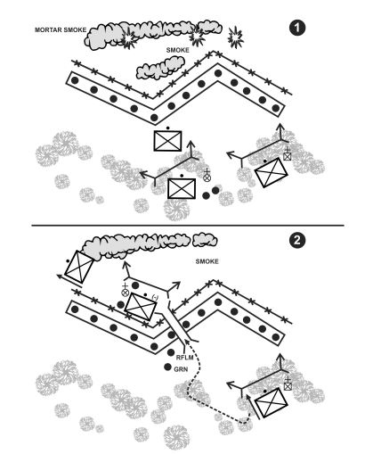

# :material-wave-arrow-up: Drill #7 | Brecha de obstáculo alambrado - minado

## Representación gráfica

## Descripción

**Situacion:** La unidad se encuentra en su camino con un obstáculo minado y alambrado que no
puede ser flanqueado o rodeado. El enemigo se encuentra abriendo fuego sobre la unidad
desde el otro lado del obstáculo. El Drill inicia cuando el líder de unidad da la orden de abrir una
brecha en el obstáculo.

**Acciones:**

1. Designar una base de fuego y un elemento de maniobra con un experto en brechas, (Capaz
de manejar explosivos, EOD preferentemente)
2. La base de fuego debe suprimir las posiciones de fuego del enemigo con superioridad de
fuego, humos (M203, 60mm, 81mm, etc...)
3. El elemento de brecha se debe acercar lo más cerca posible al obstáculo, utilizando rutas
ocultas de ser posible.

4. Se realizan las acciones para despejar un camino que permita el ingreso del elemento a
través del obstáculo.
5. La base de fuego cambia sus fuegos en una dirección lejana.
6. El elemento de brecha se filtra a través del obstáculo y asegura una posición.
7. La base de fuego se mueve hacia y a través del obstáculo.
8. La unidad asegura la posición al otro lado del obstáculo.