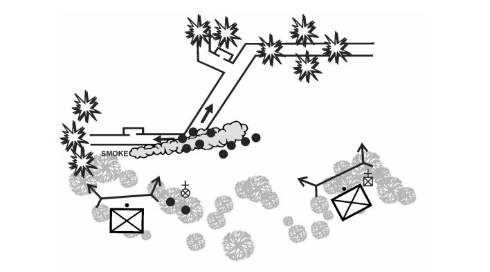

# :material-wave-arrow-up: Drill #6 | Limpiar la trinchera

## Representación gráfica

## Descripción

**Situación:** La unidad es parte del ataque e identifica una línea de trinchera enemiga.

**Acciones:**

1. El líder designa a un equipo cómo base de fuego y otro cómo maniobra
2. Se suprime la trinchera para aislar un punto de entrada.
3. El elemento de maniobra se acerca al punto de entrada con fuego y movimiento
4. Bajan su perfil y preparan granadas para lanzar dentro de la trinchera. Diciendo “VA
GRANADA A SUELO”.
5. Una vez que explotan las granadas entrar de la misma manera que se entra en una
habitación, el binomio mirando para ambos lados, moviéndose en direcciones opuestas
mientras siguen entrando los demás soldados a medida que van filtrándose en la
trinchera.
6. La base de fuego se reposiciona acorde a necesidad o se une al asalto.
7. Una vez que se haya limpiado toda la trinchera informar y posicionarse estableciendo
campos de fuego para esperar un posible contraataque.
8. Verificar munición, y estado de salud o heridos.