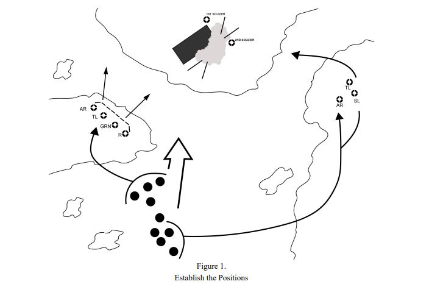

# :material-wave-arrow-up: Drill #5 | Neutralizar Bunker

## Representación gráfica

## Descripción

**Situación:** La unidad identifica enemigos en búnkeres mientras se mueven.

**Acciones:**

1. Se establece una base de fuego.
2. Se destruyen o suprimen armas emplazadas
3. Se oscurece la posición enemiga con humos (M203)
4. Se sostiene el fuego de supresión.
5. El líder identifica posiciones de apoyo y obstáculos, tamaño del enemigo, presencia de vehículos, flancos vulnerables de por lo menos un búnker y una ruta oculta hacia el flanco de dicho búnker.
6. La unidad de maniobra se mueve a través de la ruta oculta hacia el búnker elegido para atacar.
7. En la unidad de maniobra se establece un elemento de seguridad y cobertura y un elemento de asalto.
8. El elemento de asalto se acerca a la salida del búnker y prepara una granada a lanzar dentro del búnker.
9. Una vez haya explotado la granada limpiar el bunker.