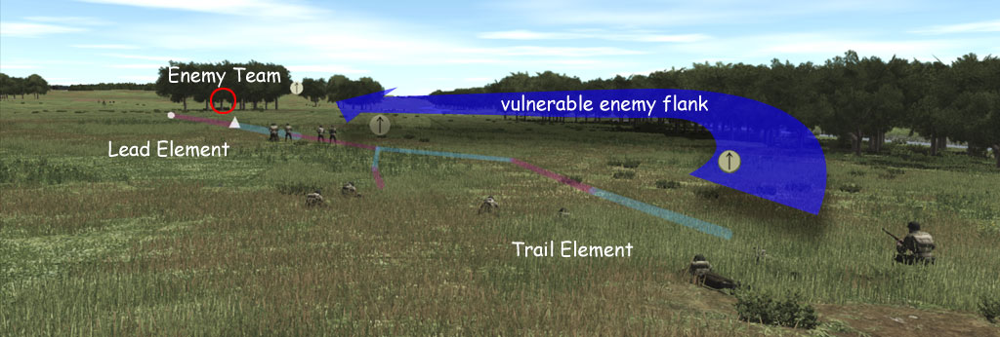

# :material-wave-arrow-up: Drill #2 | Reacción a contacto

## Representación gráfica

## Descripción

**Situación:** Un escuadrón o pelotón recibe fuego de individuos o armas estáticas.

**Acciones:**

1. Se grita CONTACTO, DIRECCION, DISTANCIA, DESCRIPCIÓN.
2. Al mismo tiempo la posición más cercana se tira a piso y devuelve fuego
inmediatamente.
3. El resto de la formación se posiciona para formar una línea de frente al fuego enemigo.
4. Se obtiene superioridad de fuegos.
5. Si el lider lo estima conveniente da la orden de “AVANZAR” y se asalta mediante fuego y
movimiento en donde el binomio/Unidad que ==NO== es del líder se mueve primero.
6. Si el líder lo estima conveniente transicionar a un ataque de escuadra (Drill #1A) o a un
quiebre de contacto (Drill #3)

## Video explicativo

<iframe 
  width="680"
  height="500"
  src="https://www.youtube.com/embed/kHDsQftUzEo" 
  frameborder="0" 
  allow="accelerometer; autoplay; clipboard-write; encrypted-media; gyroscope; picture-in-picture" 
  allowfullscreen>
</iframe>