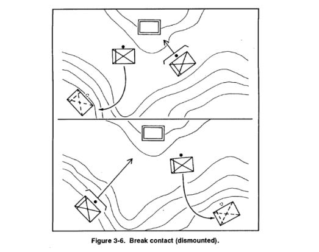

# :material-wave-arrow-up: Drill #4 | Reacción a Emboscada

## Representación gráfica

## Descripción

**Situación:** La unidad entra en una “Killzone” y el enemigo inicia una emboscada con dispositivos que produzcan bajas y alto volumen de fuego.

**Acciones:**

1. Los soldados adentro de la killzone deben inmediatamente asaltar al enemigo con fuego y movimiento. Si están al alcance, lanzar granadas.
2. Los soldados fuera de la killzone deben inmediatamente identificar las posiciones enemigas, tomar posiciones cubiertas, y dar fuego de supresión para apoyar a los soldados asaltando la posición enemiga. También oscurecer la visión del enemigo con humos (M203) priorizando armas estáticas y emplazadas.
3. Si la emboscada fue a distancia considerable los elementos que no reciben fuego deben buscar una ruta oculta a un flanco vulnerable de la posición enemiga asaltando usando fuego y movimiento.
4. Si se logra forzar al enemigo a una retirada y sobrevivir, consolidar, organizar e informar al oficial al mando.

## Video explicativo

<iframe 
  width="680"
  height="500"
  src="https://www.youtube.com/embed/dS4j-S3hYDQ" 
  frameborder="0" 
  allow="accelerometer; autoplay; clipboard-write; encrypted-media; gyroscope; picture-in-picture" 
  allowfullscreen>
</iframe>