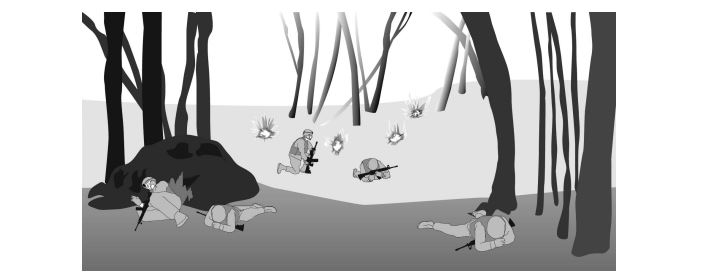

# :material-wave-arrow-up: Drill #9 | Reacción a fuego indirecto

## Representación gráfica

## Descripción

**Situación:** La unidad se encuentra moviendose o quieta, el enemigo inicia contacto de fuego
indirecto.

**Acciones:**

1. El Drill comienza con un soldado gritando “ARTILLERIA!”
2. Inmediatamente se busca cobertura o se tira a suelo
3. El líder ordena moverse a un rally point temporal, entregando dirección y distancia.
4. La unidad se mueve rapidamente al Rally Point
5. Se informa al superior estado de la unidad (Bajas, Equipamiento perdido, ubicación
actual y motivo (fuego indirecto).
9A: Cualquier herido, equipamiento o baja en la zona de impacto será rescatado solo una vez
que haya cesado el fuego en dicha zona por al menos un minuto, de otra forma se arriesgará
perder más hombres en la acción de rescate.

!!! info "Nota"
    La dirección a moverse debe encontrarse en una dirección contraria a la zona de impacto.
