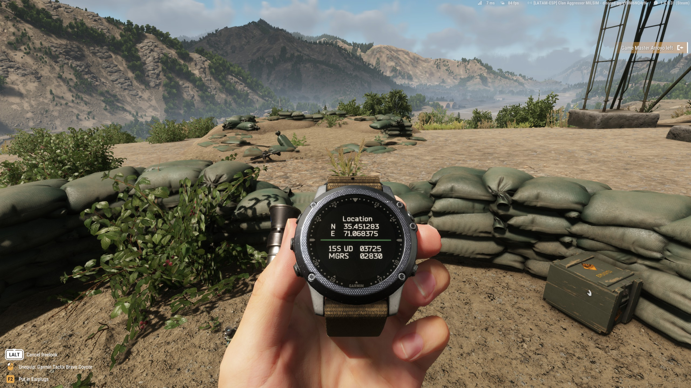
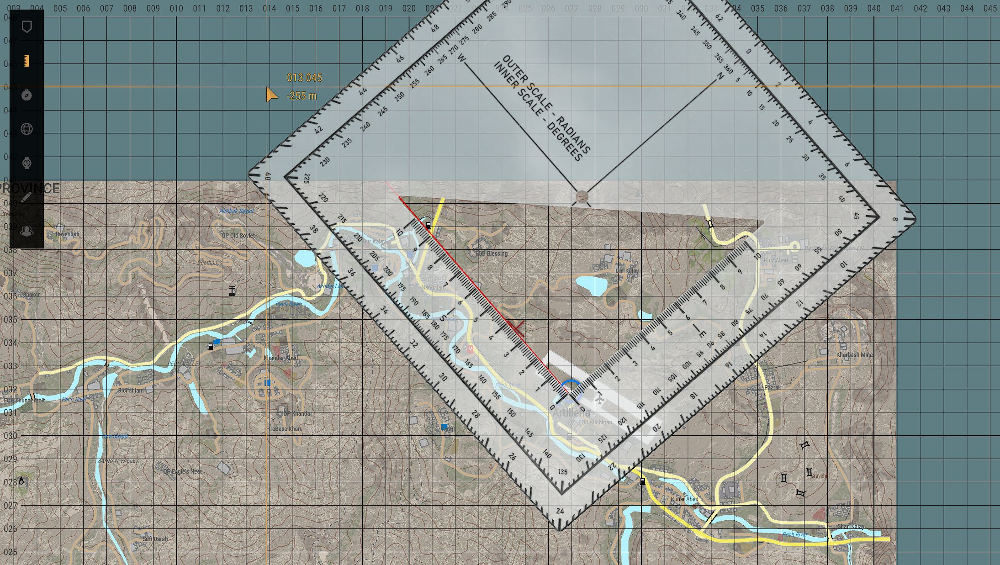
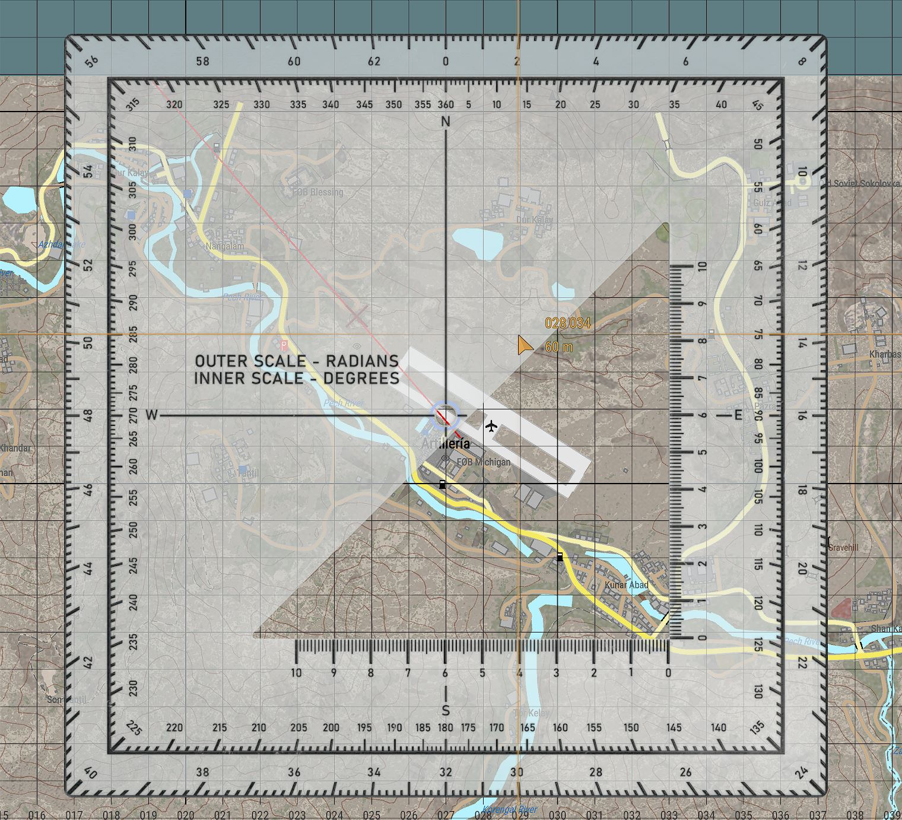
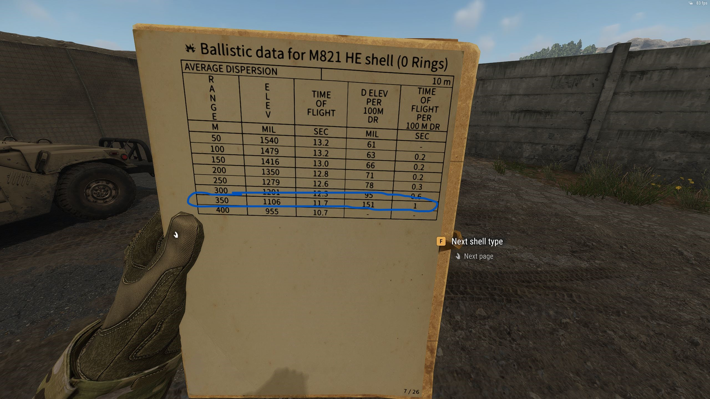
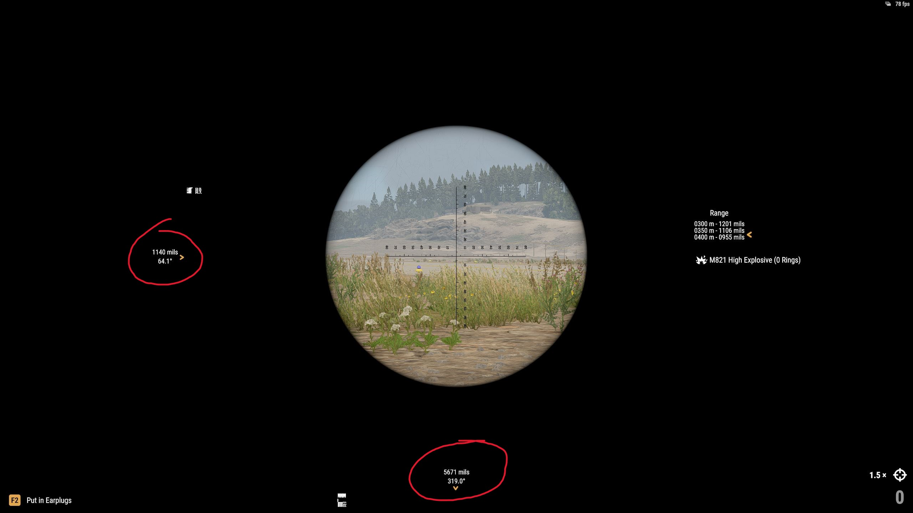
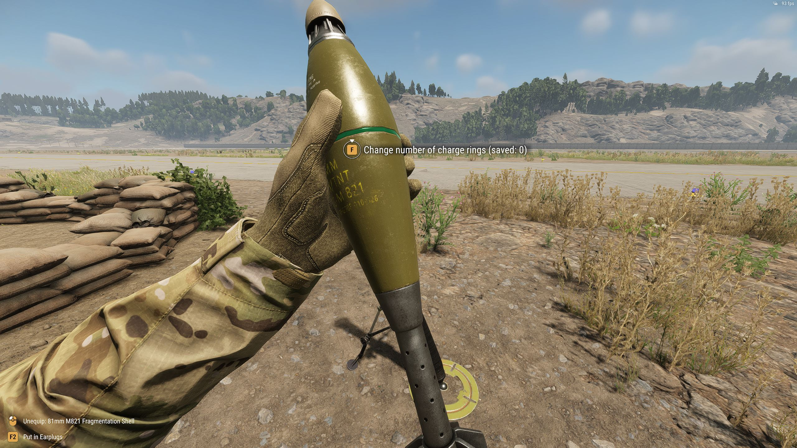
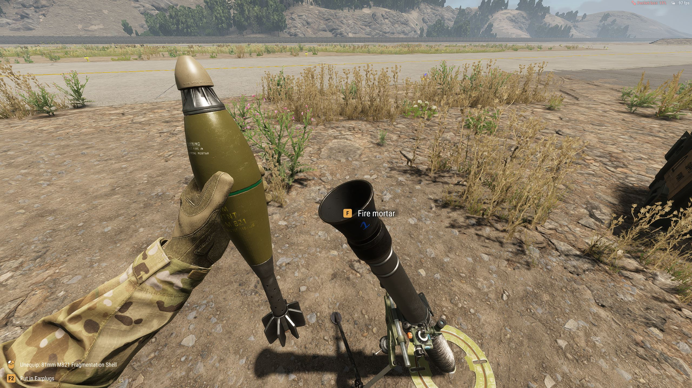

#  :material-nuke: Fuego indirecto

## Observador Avanzado

### Descripción del rol

El Observador Avanzado (OA) es un elemento clave en el campo de batalla. Su función principal es ubicar, designar y ajustar el fuego de apoyo (artillería, morteros, naval o aéreo) para apoyar al pelotón o unidad aliada. Es responsable de:

* Reconocer objetivos en el terreno y calcular su posición.
* Solicitar misiones de fuego indirecto.
* Ajustar el fuego para maximizar el impacto.
* Coordinar con el líder del pelotón y otros elementos de apoyo
* Garantizar la seguridad de las fuerzas aliadas mediante comunicación efectiva y evaluación de peligros como el fuego amigo.

---

### Movimiento y Posicionamiento del Observador Avanzado

#### Principios del movimiento
* Siempre por delante o flanco del pelotón: con suficiente cobertura y visibilidad.
* Evitar exposición directa: mantener la ocultación y alternar entre OPs (Observation Posts).
* Evita moverte con el pelotón durante contacto enemigo directo.
* Reubica cada 500 metros o después de cada fuego de misión para evitar contra fuego enemigo.

#### Selección de un Puesto de Observación (OP)
* Buena visibilidad del terreno objetivo.
* Cobertura natural (vegetación, edificaciones).
* Fácil retirada o reposicionamiento.
* Acceso a líneas de comunicación confiables.

---

### Procedimientos para Ajuste de Fuego y Solicitud de Misiones

#### Líneas de comunicación de solicitud de misión de fuego
1. El FO establece comunicación con el operador de artillería: "FO para Trueno, ¿me recibe?".
2. Orden: "Solicito ronda de spotting" | "Solicito fuego para efecto".
3. Ubicación del objetivo: "Coordenadas 031/097, TRP 0309".
4. Descripción del objetivo: "Infantería a campo abierto".
5. Tipo de munición: "Ronda HE".
6. El FO podría indicar una orden de control de fuego: Fuego a mi orden, fuego inmediato, no puedo observar.
    1. El operador de artillería realiza los calculos correspondientes
    2. Realiza un read-back de las coordenadas para confirmación.
    3. Dispara la cantidad y tipo de rondas solicitadas, indicando "Fuego - Fuego".
    4. Comunica el tiempo estimado de llegada del proyectil.
    5. 5 segundos antes del impacto, indica splash para notificar al FO y alertarlo sobre el impacto de la ronda.
    6. El FO comunica el "impacto" e indica si fue efectivo o no. Si es así, comunica "Fuego efectivo, fin de misión, corto". 
7. Si la misión de fuego era un ajuste de fuego, el FO debería solicitar fuego para efecto o podría repetir una misión de fuego comunicando: "Repita - Repita".

#### Métodos de ajuste

* Bracketing: Se dispara una ronda con rango levemente superior al estimado y luego una ronda con un rango menor al estimado de la posición del blanco. Luego se va reduciendo de 100mts o de 50mts hasta dar en el blanco.
* Disparo preciso: Cuando se tiene certeza del objetivo se realiza un ataque preciso.
* Creeping fire: Se realiza un disparo inicial a una distancia determinado del enemigo por ejemplo 800 mts. Luego se ajustan los disparon en un rango pequeño, por ejemplo 100mts. Este patrón se repite "arrastrando" los objetivos hacia la posición enemiga. El observador debe mantener el total control de la coordinación de las misiones de fuego dando autorizaciones explicitas entre cada hiteración. Es particularmente útil para proteger a tropas aliadas durante un avance.

#### Glosario del procedimiento
* Fuego - Fuego: Anuncio de la artillería ha disparado.
* Splash: Impacto en 5 segundos.
* Repita - Repita: Repetir misión con la misma data.
* Fin de misión: Indica el fin de la misión de fuego.
* Guardar como objetivo: Registrar el objetivo para uso futuro.

---

### Coordinación con unidades aliadas

#### Canales de comunicación
* Radio de pelotón: usualmente en freq 50.
* Radio principal de fuego: comunicación con elementos de apoyo de fuego, usualmente en freq 48.

#### Reportes Estándar
1. SALUTE

| Letra | Significado          | Ejemplo                             |
|-------|----------------------|-------------------------------------|
| S     | Tamaño               | "Escuadra (10 pers.)"               |
| A     | Actividad            | "Patrullando hacia el Nor-Echo"     |
| L     | Ubicación (Location) | "Coordenadas 034/064"               |
| U     | Unidad               | "Infantería Rusa, AK visibles"      |
| T     | Tiempo               | "A las 1800 hrs"                    |
| E     | Equipo               | "1 camión logísticos, armas cortas" |

2. POSREP
    * Reporte de posición del FO
    * Transmitir la posición cada 500 metros o cambios relevantes en la posición
    * Formato: "FO Bravo, POSREP: 044/092 Alpha, en OP Alpha"

3. SIREP
    * Reporte de situación táctica.
    * Incluye evaluación del enemigo, fuerzas aliadas y solicitudes.
    * Formato: "FO Alpha, SITREP: 2 secciones enemigas observadas al NE, artillería suprimió al primer blanco, morteros disponibles, solicitando reubicación de fuego hacia 039/662."

---

### Seguridad y Consideraciones Especiales

* Danger Close: Marcar una misión con Danger Close si el impacto está a 400 metros o menos.
* Tropas amigas cerca del objetivo: Utilizar creeping fire.

---

## Operador de artillería

### 1 Establecer la posición exacta de la artillería
Esto lo podemos realizar de varias maneras. La más abreviada sería usar el smartwatch Garmin para obtener las coordenadas exactas. Recuerda que puedes acceder a el con la ++o++ y para entrar al modo de posición puedes hacerlo usando ++r++ para cambiar el modo del dispositivo.

### 2 Realiza los calculos para acertar al objetivo
Asumiendo que tienes las coordenadas y referencias del blanco, vamos a utilizar el mapa y sus herramientas para calcular la distancia y dirección, desde la ubicación de la artillería hacia el objetivo. El procedimiento debería ser así:

1. Cálculo de distancia
    1. Usando las herramientas de mapa, traza una línea recta entre tu posición y el blanco.
    2. Posiciona la regla a lo largo de la línea, de manera paralela, ubicando el 0 en tu posición. Cada segmento de la regla marcado con números enteros que van del 0 al 10, representan 100 metros. En función de esto, calcula la distancia al objetivo.
      
2. Cálculo de dirección
    1. Posiciona el círculo central de las herramientas de mapa, en tu posición.
    2. Usa la línea marcada anteriormente para obtener la AZIMUTH a la que se encuentra el objetivo. La azimuth es el eje interno (inner scale) de la escuadra, va de 0 a 360. También puedes obtener los mils, estos están en el eje más al exterior de la cuadrícula (outer scale), va de 0 a 64. Para el ejemplo, la azimuth obtenido es 319. 
    
3. Obtenida la distancia, procedemos a consultar nuestra hoja de datos balísticos para buscar el ajuste más próximo a la distancia obtenida. Es importante intentar buscar siempre la página correspondiente a la munición que estamos utilizando que indique la menor dispersión en metros posible. En el ejemplo, la distancia es de aproximadamente 330 mts. Recuerda que puedes navegar por los tipos de munición y la cantidad de anillos para buscar la menos dispersión, inspeccionando la hoja con ++r++ y presionando ++f++ en la opción deseada (próxima página o siguiente tipo de munición) Dado que la distancia que tenemos en la hoja no es exactamente la distancia que debemos ajustar, podemos hacer un ajuste rápido aproximado. Por norma general, a menor elevación, hay más alcance y viceversa. Por lo tanto, en este caso, debemos aumentar la elevación para reducir el alcance a 330 mts. Yo cambiaré el valor de la hoja (1106) a 1140.

4. Con la dirección apuntada en azimuth o mils, debes realizar el ajuste ya operando el motero (haremos lo mismo con la elevación), Entonces, para la dirección usaremos la azimuth 319 y para la elevación usaremos 1140. Para ajustar la elevación, usaremos las teclas ++w++ y ++s++ y para ajustar la dirección las teclas ++a++ y ++d++.

5. Ajuste de los anillos de propelente en la munición.
    * En el ejemplo determinamos que vamos a usar una ronda HE con 0 anillos de propelente, buscando la menor dispersión.
    * Vamos a eliminar los anillos de la munición para ajustarnos a lo que la hoja de datos balísticos nos indica y a los cálculos que hemos hecho.
    * Para ello te vas a equipar la munición y con la tecla ++r++ vamos a inspeccionar la munición.
    * Luego, manteniendo la tecla ++f++ presionada vamos a aumentar o disminuir la cantidad de anillo con la rueda del scroll del mouse. En el ejemplo, debemos indicar 0 anillos.
    
6. Finalmente, nos acercamos a la boca del mortero con la munición equipada y disparamos presionando ++f++.

## Vídeo explicativo

<iframe width="680" height="500" src="https://www.youtube.com/embed/vmjEoPif1u8?si=QCLSyHNmT6aF_-Z7&amp;start=10" title="YouTube video player" frameborder="0" allow="accelerometer; autoplay; clipboard-write; encrypted-media; gyroscope; picture-in-picture; web-share" referrerpolicy="strict-origin-when-cross-origin" allowfullscreen></iframe>

