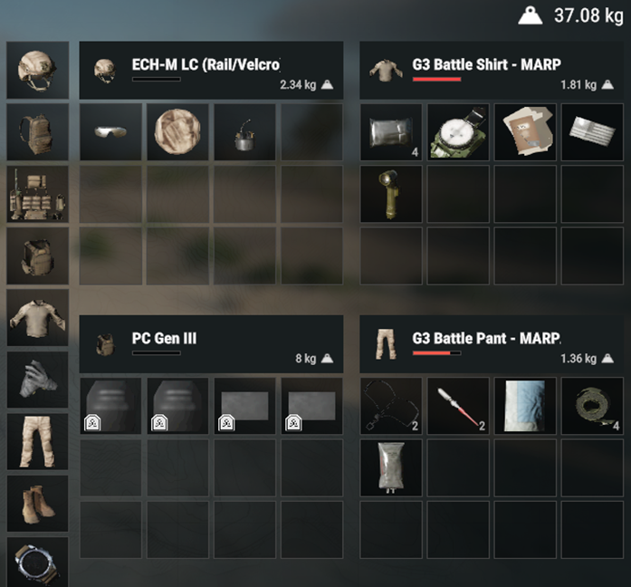
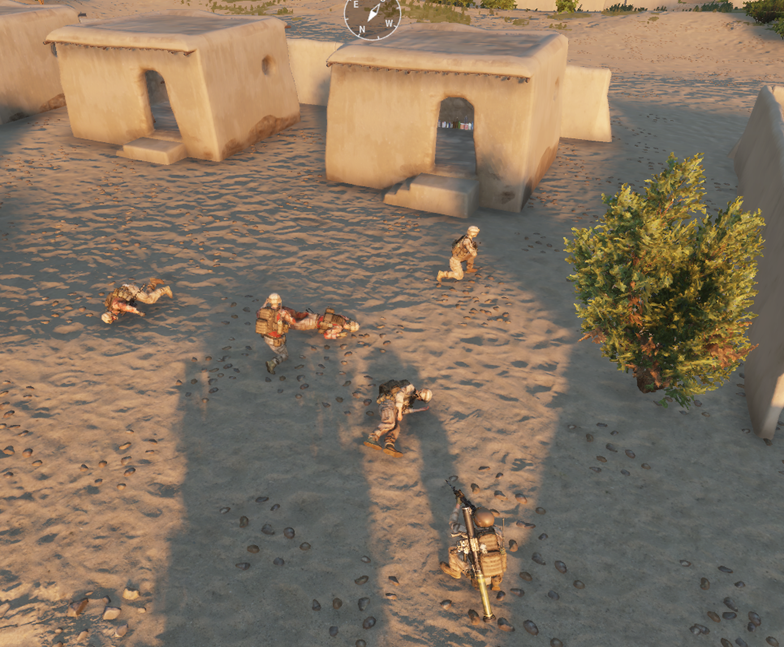

#  :material-medical-bag: Médico de Combate

## El rol de Médico

Como Médico de combate, tu filosofía debe ser la de preservar el bien mayor,
y eso involucra a cada miembro del equipo, en priorización de la escala
jerárquica de mando.

Debes ser asertivo, si encuentras a varios soldados alrededor de un ==HERIDO==
que requiere asistencia médica. Debes informar que eres el Médico que
atenderá al herido y el resto debe seguir con sus roles.

Para esto debes comunicarte efectivamente. Mantén a los demás alrededor
informados de tus acciones, habla a quién estás tratando, deben saber que
pronto despertarán o que quizás tengan que esperar un poco más.

Cuando llegues a una ubicación bajo fuego enemigo asegúrate de comprobar
el estado de tus compañeros de manera verbal. Si tienes soldados heridos
procede a la realización de tu rol según Flujograma de la Atencion de
Heridos.

Este rol es indispensable para el equipo, por lo que deberás poner tu
seguridad como prioridad. La única excepción es durante una reacción a
contacto, donde debes ==RESPONDER== al fuego, de esta manera se ganará
superioridad de fuego.

Viaja ligero para mantenerte móvil, la ligereza es referida a tus implementos
de combate.

Siempre se debe tener conciencia que para atender a un herido, la escena
debe ==SER SEGURA==. Por lo que es importante la coordinación con los aliados
para la movilización de múltiples heridos, para la atención y estabilización de
estos.

Los Factores para tomar esta toma de decisiones deben ser en base al
contexto que se enfrenta ejemplo: N° de enemigos cercanos, Presencia de
Vehículo Artillado, Presencia de Fuego Indirecto enemigo, cantidad de
suministros médicos, Orden de movimiento por Líder, etc.
---

## Equipamiento del Médico
| CATEGORÍA        | ÍTEM                                           | CANTIDAD |
|:-----------------|:-----------------------------------------------|:---------|
| CASCOS           | `ECH-M LC (Ral/Velcro) + LC Helmet Cover`      | n/a      |
| TORSO            | `G3 Battle Shirt`                              | n/a      |
| PANTALONES       | `RCKY S2V Predator Boots`                      | n/a      |
| BOTAS            | `Libre`                                        | n/a      |
| PLACAS           | `PC GEN III`                                   | n/a      |
| PORTA CARGADORES | `Pouch Preset PC Gen III`                      | 8        |
| LENTES           | `Librea`                                       | n/a      |
| GUANTES          | `Mechanix M-Pact gloves - Black`               | n/a      |
| NVG              | `AN/PVS-31`                                    | n/a      |
| FUSIL            | `M27`                                          | n/a      |
| ACCESORIOS ARMA  | ` M150 RCO (ARD) - AN/PEQ 16 - Surefire M300c` | n/a      |
| ACCESORIOS ARMA  | `- 6in.Low-RailCover (M27) - FH556RC`          | n/a      |
| MUNICIÓN         | `M855A1  3 - M855A1/M856 MCT 3`                | n/a      |
| SECUNDARIA       | `M18`                                          | n/a      |
| MOCHILA          | `FILBE BackPack `                              | n/a      |
| INSUMOS MEDICOS  | `Vendaje`                                      | 10       |
| INSUMOS MEDICOS  | `Morfina`                                      | 10       |
| INSUMOS MEDICOS  | `Naloxona`                                     | 10       |
| INSUMOS MEDICOS  | `Metropolol`                                   | 10       |
| INSUMOS MEDICOS  | `Phenylephrine`                                | 10       |
| INSUMOS MEDICOS  | `Epinephrine`                                  | 10       |
| INSUMOS MEDICOS  | `Sueros`                                       | 8        |
| EXTRA            | `Humos: Verde, Amarillo y Púrpura`             | 8        |

 

 
 

---
## Triage
El Triage trata de priorizar y atender primero a los más graves, esto se hace en la mayoría de las situaciones. 

* <b>Heridos inestables (SV inestable):</b> probablemente inconscientes, sin sangre, heridas abiertas que requieren atención inmediata o se mueren. 
 ==<b>Recuerda:</b> siempre revisar pulso para identificar PC.== 
* <b>Heridos Semi-estable:</b> Soldados que se encuentren con SV estables pero inconscientes, al punto de no requerir atención inmediata, aunque deben ser mantenidos en mente.
* <b>Heridos Estables:</b> Se encuentran con heridas leves, con pérdida de Volumen <20% (Clase I hemorragia). Solo requieren atención médica después de los niveles anteriores, pueden caminar y combatir.
* <b>Muerto:</b> ==Fue el Royalo== :skull:

Cada situación va a requerir que tomes decisiones, no es algo que puedas leer e inmediatamente saber.
 
 
Por ejemplo puedes llegar a un lugar con varias bajas y heridos ==(CONSCIENTES)== y puedes...
 
!!! quote "Dar la orden:"
    ¡TODOS LOS QUE TENGAN MÚLTIPLES HERIDAS CONMIGO, EL RESTO TORNIQUETE Y SIGUE CUBRIENDO!

 

---
## Triage Inverso

El Triage Inverso es básicamente es una situación particular e inusual, se da cuando tus suministros médicos son <b>escasos y tienes mucha gente herida</b>.

Para estas situaciones se debe priorizar el colocar a punto la mayor cantidad de rifles de vuelta al campo, por ende, si existe un herido que, por el grado de las heridas, la cantidad de heridas o la cantidad de sangre que puedes restaurar, morirá. Lamentablemente contará como un herido de “No Resucitable ==(NR)==”.

Para evitar este tipo de situaciones, tu equipamiento debe estar equilibrado y acorde a la misión.

Así que, SI frecuentemente te vas encontrando, con la situación de que se agotan ciertos insumos de tu inventario, debes preguntarte: ¿Traigo suficientes? o puede ser ¿Estoy usándolos sin una verdadera necesidad?

También recuerda, el inventario del vehículo no es solo para colocar munición, tampoco es para llenar de insumos médicos, todo debe ser equilibrado.
 
 

---
## Signos Vitales
Los Signos Vitales son el reflejo del estado de salud del soldado herido. Por lo que es vital importancia la interpretación de estos datos, para comprender que tipo de tratamiento necesita (Inyectores), como además de identificar Posible complicaciones que lleven a un PA

Por configuración actual de ACE medical Prototype con Basedate ARMA Reforger, se dejarán todas aglomeradas según ==ESTADO==.

| ESTADO    | PULSO (LPM)              | PRESIÓN (mmhg)     | CLASE HEMORRAGIA |
|:----------|:-------------------------|:-------------------|:-----------------|
| Riesgo PC | `<20`                    | `<51/34`           | -                |
| Inestable | `BR: <40`  `TQ: >190` | `<80/40`           | `II`* `III` `IV` |
| Estable   | `50 - 180`               | `100/60` `240/170` | `I` `II`         |
| Riesgo PC | `<210`                   | `<280/180`         | -                |
!!! info "*"
    *Se dejará como posible estado de inestable la hemorragia Clase II con inconsciencia.
 
Los volúmenes sanguíneos se clasifican en seis clases

| N° | CLASE DE HEMORRAGIA  | PÉRDIDA DE SANGRE |
|----|----------------------|-----------------|
| 0  | NORMAL               | `NORMAL`        |
| 1  | Clase I              | `Pérdida < 20%` |
| 2  | Clase II             | `Pérdida < 30%` |
| 3  | Clase III            | `Pérdida < 60%` |
| 4  | Clase IV             | `Pérdida < 80%` |
| 5  | Clase V - ==MORTAL== | `Pérdida 100%`  |

La clase de hemorragia, dictara <b>cuánta</b> solución salina (SS) necesitará el soldado herido para reponer volumen sanguíneo. 

También debe tener en consideración a la hora de la administración de SS con la <b>presión arterial</b>. Ya que el SS no solo aumenta el volumen sanguíneo sino también la Presión Arterial.

---
## Inyectores
El rol de Médico tiene disponible dentro de su equipamientos, estos inyectores que ayudan a la estabilización y/o recuperación del estado de salud del herido. Siempre se debe tener en consideración la <b>“Hora”</b> de administración del Inyector, ya que la sobredosis de estos pueden causar la descompensación y/o muerte del herido. 

Actualmente la sincronización de la hora RELOJ (ítem) vs La hora de administración mostrada en “COMPROBACIÓN DE HERIDAS” tendría un delay de 1-2 min. Siendo la hora RELOJ (ítem) más retrasada. 

| INYECTORES         | EFECTOS                                                                                                           |
|--------------------|-------------------------------------------------------------------------------------------------------------------|
| Ammonium carbonate | Despierta a pacientes inconscientes estables                                                                      |
| Epinephrine        | - Aumenta la probabilidad de reanimación.  - Aumenta la frecuencia cardíaca  - Aumenta la presión arterial. |
| Metoprolol         | - Disminuye la frecuencia cardíaca - Disminuye la presión arterial.                                            |
| Morphine           | - Suprime el dolor  - Disminuye la frecuencia cardíaca  - Disminuye la presión arterial                     |
| Naloxone           | Trata la sobredosis de morfina                                                                                    |
| Phenylephrine      | - Disminuye el sangrado y las transfusiones  - Aumenta la presión arterial.                                    |

### Tabla de Aplicación de Inyectores según SV

#### Aplicación de Fármaco Metoprolol       

| SIGNOS VITALES (SV) |                BRADICARDIA                |                   TAQUICARDIA                   |
|---------------------|:-----------------------------------------:|:-----------------------------------------------:|
| Presión Alta        | :fontawesome-solid-circle-xmark:{ .not }  |    :fontawesome-solid-circle-check:{ .yes }     |
| Presión Normal      | :fontawesome-solid-circle-xmark:{ .not }  |    :fontawesome-solid-circle-check:{ .yes }     |
| Presión Baja        | :fontawesome-solid-circle-xmark:{ .not }  |    :fontawesome-solid-circle-xmark:{ .not }     |

#### Aplicación de Fármaco Epinephrine        

| SIGNOS VITALES (SV) |                BRADICARDIA                |                   TAQUICARDIA                   |
|---------------------|:-----------------------------------------:|:-----------------------------------------------:|
| Presión Alta        | :fontawesome-solid-circle-xmark:{ .not }  |    :fontawesome-solid-circle-xmark:{ .not }     |
| Presión Normal      | :fontawesome-solid-circle-check:{ .yes }  |    :fontawesome-solid-circle-xmark:{ .not }     |
| Presión Baja        | :fontawesome-solid-circle-check:{ .yes }  |    :fontawesome-solid-circle-xmark:{ .not }     |

#### Aplicación de Fármaco Phenylephrine        

| SIGNOS VITALES (SV) |                BRADICARDIA                |                   TAQUICARDIA                   |
|---------------------|:-----------------------------------------:|:-----------------------------------------------:|
| Presión Alta        | :fontawesome-solid-circle-check:{ .yes }  |    :fontawesome-solid-circle-xmark:{ .not }     |
| Presión Normal      | :fontawesome-solid-circle-check:{ .yes }  |    :fontawesome-solid-circle-xmark:{ .not }     |
| Presión Baja        | :fontawesome-solid-circle-check:{ .yes }  |    :fontawesome-solid-circle-xmark:{ .not }     |

#### Tabla Resumen de inyectores

| INYECTOR  | Tmax Efc     | Vida media    | Sobredosis (Referencia estimada) | Sobredosis PC (Referencia estimada) |
|:----------|:-------------|:--------------|:---------------------------------|-------------------------------------|
| Ammonium carbonate  | 2 a 3 seg    | 3 a 4 seg     | -                                | -                                   |
| Epinephrine | 23 seg       | 1 min 3 seg   | -                                | 4,4                                 |
| Phenylephrine   | 29 seg       | 1 min 18 seg  | -                                | 2,9                                 |
| Metoprolol | 25 seg       | 1 min 9 seg   | 2,8                              | >3                                  |
| Morphine | 1 min 57 seg | 15 min 20 seg | 3,1                              | 3,8                                 |
| Naloxone | 1 min 35 seg | 7 min 26 seg  | -                                | -                                   |

---

## Flujograma de atención al herido

Es como debería ser el actuar de la persona encargada del Rol de Médico, en los distintos escenarios que se presenten tanto en Estado de conciencia y gravedad (SV).

Además muestra la manera de cómo tratar desde el inicio a un herido para poder recuperarlo lo antes posible para volver al combate. 

En casos donde sean <b>MÚLTIPLES</b> los heridos se debe realizar el triage por personas de mayor a menor gravedad de sus SV + Consideración de tipo de Hemorragia presente. 

Los Factores para tomar esta toma de decisiones deben ser en base al contexto que se enfrenta ejemplo: N° de enemigos cercanos, presencia de Vehículo Artillado, presencia de Fuego Indirecto enemigo, cantidad de insumos médicos disponibles, Órden de Líder.

---

## Paro Cardiaco

El Paro Cardiaco, es el cese de las funciones del corazón por consiguiente la pronta muerte inminente de la persona herida.

Para esto se establece el Protocolo de asistencia a Paro Cardiaco por parte de Medico Combate

### Escena Segura (Conciencia Situacional)

1.	Tomar Pulso al paciente (Se identifica el estado del paciente) 
2.	Pulso, en Paro Cardiaco se encontrara en 0  (La PA igual estará en 0/0 mmhg)
3.	==Iniciar Compresiones (RCP) por al menos 1 min :asterisk: seguidas sin interrupciones :asterisk:==
4.  Inyecte 1 epinefrina en algún brazo (Esperar 1 min para próxima dosis)
5.	Administre Salino  según Presión + Clase de Hemorragia. 
6.	Una vez terminado el tiempo de RCP , vuelva a repetir paso 1. 	
7.	Si el paciente sigue en PCR, inyecte 1 epinefrina (según última dosis)
8.	Luego reinicie RCP por al menos 1 min de compresiones. Y vuelva a repetir paso 2.
9.	Cuando ocurre que tiene pulso presente (ósea >0). Pase al flujograma de Escenario 1 o 2.

!!! info ":asterisk:"
    :asterisk: Si es el Único Médico y puede delegar este rol a otros soldados (contexto) para la administración de tratamiento, HÁGALO.(posterior vuelva a realizar RCP, usted si es necesario). 
    :asterisk: Si son ≥ 2 Médico atendiendo a un paciente se deben repartir los Roles con comunicación asertiva. 
    :asterisk: La cantidad de cuanto RCP realizar, es variada, se debe hacer hasta que tenga pulso + dar tiempo a la Administración de Salino (Para recuperación de volumen). 

